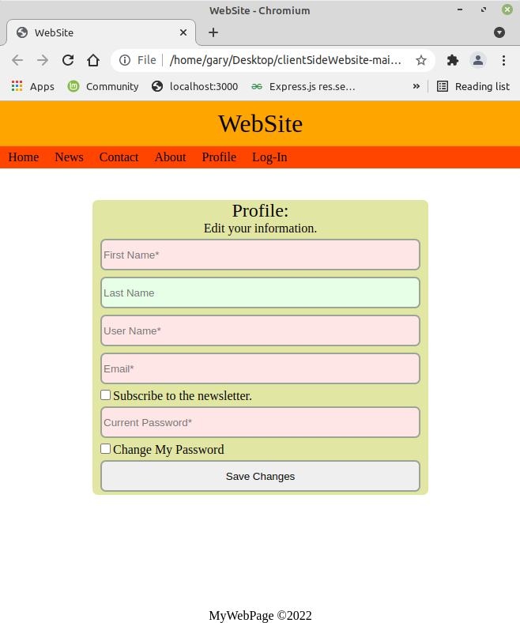

# clientSideWebsite
Here is a base website, entirely run from client side.

There are a lot of pages where the main content is switched out, like in the case of 'including' `<main></main>` html content depending on the requested website page.  This is done in PHP for example commonly.

This website replaces the main content by showing the correct main based on which link is picked.  It is a single page application, but will switch out content based on navigation list.  At the current time, it will be loaded and entirely run offline and in fact will also run as a desktop file.

To save or load back and forth with a webserver, you'll need to use some method like 'fetch' or XMLHttpRequest to get info, and get or post to send data.  It has minimum styling but is resonsive with a collapsable menu set for mobile size.

